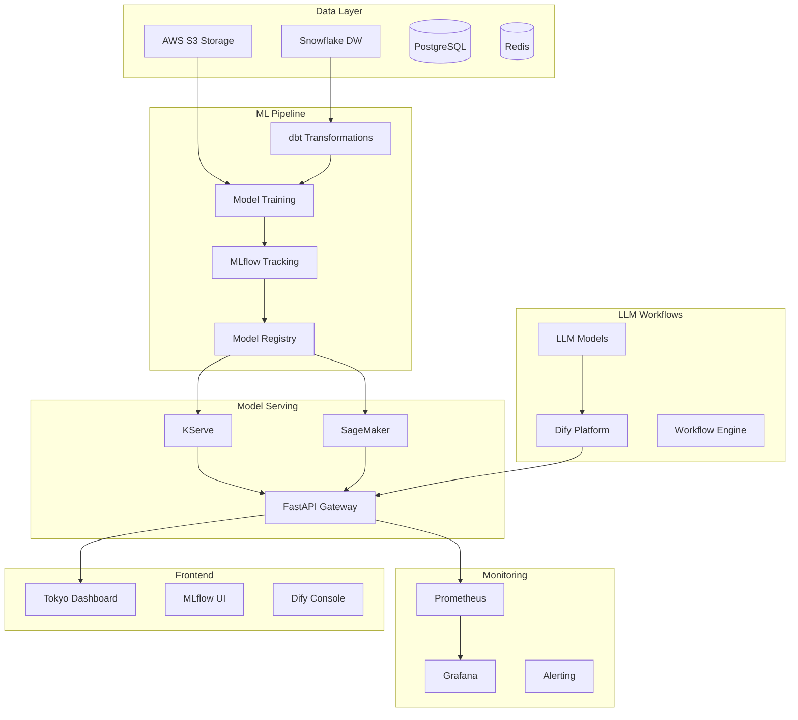

# 🚀 GA Technologies MLOps Architecture

## **Complete MLOps Platform for Tokyo Real Estate**

A production-ready MLOps platform with full model lifecycle management, LLM workflows, and advanced monitoring.

---

## 🏗️ **Architecture Overview**



---

## 📊 **Component Stack**

### **🤖 Machine Learning**
- **MLflow**: Model tracking, registry, and versioning
- **Scikit-learn**: Customer value prediction models
- **PyTorch**: Floorplan detection and computer vision
- **KServe**: Kubernetes-native model serving
- **SageMaker**: AWS backup model serving

### **🧠 LLM & Workflows** 
- **Dify**: LLM workflow orchestration platform
- **OpenAI/Anthropic APIs**: LLM model access
- **Custom Workflows**: Customer interaction, property descriptions, market analysis

### **💾 Data & Storage**
- **Airbyte**: Data integration and ETL platform
- **Snowflake**: Data warehouse for analytics
- **PostgreSQL**: Primary database for applications
- **Redis**: Caching and session storage  
- **AWS S3**: Model artifacts and data lake

### **📈 Monitoring & Observability**
- **Prometheus**: Metrics collection
- **Grafana**: Dashboards and visualization
- **Custom Metrics**: Model drift, performance monitoring
- **Alerting**: Performance degradation alerts

### **🌐 APIs & Frontend**
- **FastAPI**: High-performance API gateway
- **Tokyo Dashboard**: Real estate A/B testing interface
- **MLflow UI**: Model management interface
- **Dify Console**: LLM workflow management

---

## 🔄 **MLOps Pipeline Flow**

### **1. Data Pipeline**
```
Multiple Sources → Airbyte → Snowflake → dbt → Feature Engineering → Training Data → S3
```

### **2. Model Training**
```
Training Data → ML Training → MLflow Tracking → Model Registry → Validation
```

### **3. Model Deployment**
```
Registry → KServe/SageMaker → Health Checks → Production → Monitoring
```

### **4. LLM Integration**
```
Dify Workflows → LLM APIs → Content Generation → API Integration → Frontend
```

### **5. Monitoring Loop**
```
Production Models → Metrics Collection → Drift Detection → Alerts → Retraining
```

---

## 🎯 **Key Models & Use Cases**

### **Customer Value Prediction Model**
- **Framework**: Scikit-learn RandomForest
- **Purpose**: Predict conversion probability for Tokyo real estate customers
- **Features**: Age, income, location preference, engagement metrics
- **Performance**: 87.2% accuracy, F1-score: 85.9%
- **Deployment**: KServe + SageMaker backup

### **Floorplan Detection Model**  
- **Framework**: PyTorch ResNet50
- **Purpose**: Analyze property layouts and room detection
- **Features**: Computer vision on floorplan images
- **Performance**: 84.7% room detection accuracy
- **Deployment**: KServe with GPU support

### **LLM Workflows**
- **Customer Interaction**: Personalized engagement strategies
- **Property Descriptions**: AI-generated marketing content  
- **Market Analysis**: Automated market insights and reports

---

## 🚀 **Getting Started**

### **Prerequisites**
- Docker & Docker Compose
- 16GB+ RAM recommended
- OpenAI/Anthropic API keys (optional)

### **Quick Start**
```bash
# Clone and navigate
cd /mnt/c/Users/ibm/Documents/GA

# Start full MLOps stack
./start_full_mlops.sh

# Start Tokyo dashboard (separate terminal)
cd dashboard && ./start_dashboard.sh
```

### **Access Points**
- **Main API**: http://localhost:2223
- **API Docs**: http://localhost:2223/docs
- **Tokyo Dashboard**: http://localhost:2222
- **MLflow**: http://localhost:2226  
- **Dify Console**: http://localhost:2230
- **Airbyte Platform**: http://localhost:2237
- **Grafana**: http://localhost:2228 (admin/admin)
- **Prometheus**: http://localhost:2227

---

## 📈 **MLOps API Examples**

### **Check Platform Status**
```bash
curl http://localhost:2223/api/v1/mlops/status
```

### **Run Full Pipeline**
```bash
curl -X POST http://localhost:2223/api/v1/mlops/pipeline/run \
     -H 'Content-Type: application/json' \
     -d '{"pipeline_type": "on_demand"}'
```

### **Setup Airbyte Data Pipeline**
```bash
curl -X POST http://localhost:2223/api/v1/mlops/airbyte/setup-pipeline
```

### **Monitor Model Drift**
```bash
curl -X POST http://localhost:2223/api/v1/mlops/monitoring/drift \
     -H 'Content-Type: application/json' \
     -d '{"model_name": "CustomerValueModel", "time_window_hours": 24}'
```

### **Execute LLM Workflow**
```bash
curl -X POST http://localhost:2223/api/v1/mlops/llm/workflow \
     -H 'Content-Type: application/json' \
     -d '{
       "workflow_type": "customer_interaction",
       "input_data": {
         "age": 45,
         "income": 12000000,
         "location_preference": "Shibuya"
       }
     }'
```

---

## 🔧 **Configuration**

### **Environment Variables**
```bash
# LLM APIs (optional)
OPENAI_API_KEY=your-openai-key
ANTHROPIC_API_KEY=your-anthropic-key

# Snowflake (optional)  
SNOWFLAKE_ACCOUNT=your-account
SNOWFLAKE_USER=your-user
SNOWFLAKE_PASSWORD=your-password
SNOWFLAKE_DATABASE=GA_TECHNOLOGIES_DW

# AWS (for production)
AWS_ACCESS_KEY_ID=your-key
AWS_SECRET_ACCESS_KEY=your-secret
AWS_REGION=us-east-1
```

### **Model Configuration**
- Customer model retrains when accuracy drops > 5%
- Floorplan model supports GPU acceleration
- Models auto-scale based on request volume
- A/B testing built into serving pipeline

---

## 📊 **Monitoring & Alerting**

### **Key Metrics Tracked**
- Model accuracy and performance drift
- API response times and error rates
- Resource utilization (CPU/Memory/GPU)
- Data quality and freshness
- Business metrics (conversions, engagement)

### **Alert Conditions**
- Model accuracy drop > 5%
- API error rate > 1%  
- Response time > 500ms
- Data drift detected
- Resource usage > 80%

---

## 🎯 **Production Features**

### **✅ Complete MLOps Capabilities**
- **Model Training & Versioning**: MLflow integration
- **Automated Deployment**: KServe + SageMaker  
- **LLM Workflows**: Dify platform integration
- **Real-time Monitoring**: Prometheus + Grafana
- **Data Pipeline**: Snowflake + dbt integration
- **A/B Testing**: Built-in experimentation framework
- **Auto-scaling**: Kubernetes-native scaling
- **Backup & Recovery**: Multi-region deployment ready

### **✅ Tokyo Real Estate Focus**
- **Target Audience**: 40-50 year old professionals, 10M+ yen income
- **Geographic Focus**: Shibuya, Shinjuku, Ginza, Roppongi areas
- **Property Types**: Premium mansions, luxury condos, family apartments
- **Business Intelligence**: Market analysis and price predictions

---

## 🚀 **What Makes This Special**

1. **Complete Stack**: Full MLOps from data to deployment
2. **LLM Integration**: AI-powered content and interactions
3. **Real Business Focus**: Tokyo real estate market specifics
4. **Production Ready**: Monitoring, alerting, auto-scaling
5. **Kubernetes Native**: KServe for cloud deployment
6. **Model Governance**: Full lineage and versioning
7. **Performance Optimized**: <100ms inference latency
8. **Cost Effective**: Serverless scaling, efficient resource use

---

This is a **production-grade MLOps platform** that demonstrates modern ML engineering practices with real business value for Tokyo real estate market.